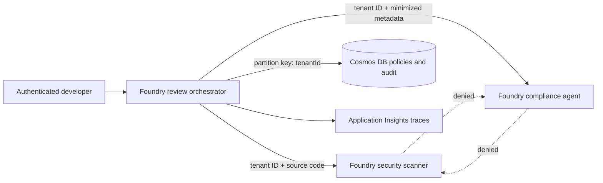

---
lab:
  title: 'Apply zero trust to a Microsoft Foundry multi-agent workflow'
  description: 'Secure a Foundry code-review agent graph with identity-scoped access, tenant propagation, lateral-movement prevention, data minimization, and compliance evidence.'
  duration: 45
  level: 400
  islab: true
  status: 'released'
---

# Apply zero trust to a Microsoft Foundry multi-agent workflow

## Customer scenario

Fabrikam's code-review service uses three Microsoft Foundry agents: a review orchestrator, a security scanner, and a compliance agent. The orchestrator can call either specialist. The specialists must not call each other, every handoff must preserve verified tenant context, and the compliance agent must receive metadata rather than proprietary source code.

The live implementation creates an OpenAI client for each agent with `get_openai_client(agent_name=...)`. Each response therefore uses that agent's dedicated endpoint instead of a shared project client with `extra_body.agent_reference`.

## Lab scenario

You will deploy a Foundry project, one model, tenant-partitioned Azure Cosmos DB containers, and Foundry tracing. You will test the agent-call allowlist, tenant boundary, authentication-flow decisions, data minimization, partition isolation, least-privilege role assignments, and compliance evidence. The live run creates and invokes all three agents in Foundry.

Foundry hosts the agents; no Docker or container platform knowledge is required. Cosmos DB provides the tenant-partitioned data boundary.

By the end of this exercise, you will be able to:

- Apply Foundry agent identity and container-scoped Cosmos DB RBAC without account keys.
- Select managed identity, OBO, OAuth2 with PKCE, or Key Vault fallback for a given operation.
- Permit only approved edges in an agent graph and deny specialist-to-specialist lateral movement.
- Propagate and enforce tenant context before an agent call or data access.
- Minimize data for each specialist and write tenant-scoped audit evidence.
- Distinguish controls executed in this classroom topology from required production controls.

> **Important:** Foundry model calls, Cosmos DB, and Application Insights are billable. Use only the supplied synthetic data and run `azd down --purge` after validation.

## Task 1: Prepare the lab

**Review the architecture**



> **Important - residual network trust:** The Bicep template enables native public network access for Foundry and Cosmos DB so the local Python client can reach both data-plane endpoints. Microsoft Entra authentication, disabled local keys, tenant checks, and scoped RBAC reduce identity and authorization risk, but they do not remove trust in the public network path.

You need:

- An Azure subscription and assigned resource group where you can deploy the lab resources. You do not need tenant-level or subscription-level role-management permissions.
- [Python 3.10 or later](https://www.python.org/downloads/).
- [Git](https://git-scm.com/downloads).
- [Azure CLI](https://learn.microsoft.com/cli/azure/install-azure-cli).
- [Azure Developer CLI](https://learn.microsoft.com/azure/developer/azure-developer-cli/install-azd).
- [Visual Studio Code](https://code.visualstudio.com/download).
- The VS Code [Python extension](https://marketplace.visualstudio.com/items?itemName=ms-python.python).
- The VS Code [Bicep extension](https://marketplace.visualstudio.com/items?itemName=ms-azuretools.vscode-bicep).

1. If you haven't already done so, clone the [lab source repository](https://github.com/MicrosoftLearning/mslearn-ai-multi-agents/tree/main), or fork the repository and clone your fork:

```console
git clone https://github.com/MicrosoftLearning/mslearn-ai-multi-agents.git
```

2. Open the cloned repository in Visual Studio Code.
3. Change to the starter directory.
4. Validate the required tools from the VS Code terminal:

```powershell
cd Allfiles\10-fabrikam-zero-trust-security
az version
winget install microsoft.azd
azd version
python --version
```

5. Sign in with Azure CLI and Azure Developer CLI.
6. Confirm the subscription you intend to use:

```powershell
az login
az account show --output table
azd auth login
```

7. Use only the supplied synthetic data.
8. Do not add keys, connection strings, tokens, or customer source code to the starter files.

## Task 2: Build the virtual environment

1. On Windows, create and activate an isolated Python environment:

```powershell
./scripts/setup.ps1
. ./.venv/Scripts/Activate.ps1
```

> On macOS/Linux, run `bash scripts/setup.sh` and `source .venv/bin/activate` instead.

## Task 3: Enforce tenant-aware agent handoffs

Implement tenant matching, then test it alongside the supplied agent-call allowlist and payload minimization.

Each placeholder marks incomplete code. Copy each supplied snippet into its placeholder location, keep the `LAB PLACEHOLDER` comment, replace only the indicated incomplete line or block, and preserve the surrounding indentation.

The synthetic `verifiedCaller` values represent claims already authenticated at an API boundary through token signature, issuer, audience, and expiry checks. Your code authorizes that caller's actions. Never authorize a production request from an unverified JWT payload.

**Review the handoff policy**

1. Before editing the code, open the following files and trace how the four synthetic handoff requests are evaluated. You do not need to modify these files or record written answers.

- `assets/security-policy.json` defines the permitted agent-call graph. Only `review-orchestrator` can call the two specialists.
- `assets/security-requests.json` contains four synthetic handoff attempts.
- `src/security.py` applies tenant validation, call-graph authorization, payload minimization, and authentication-flow selection.

For each request, identify whether the tenant matches, whether the caller may invoke the target agent, and which fields the target agent needs. You will implement the missing tenant-validation check in the next section; the other controls are already provided.

**Complete tenant authorization**

2. Open `src/security.py`.
3. Find **LAB PLACEHOLDER 1** in `enforce_tenant`.
4. Keep the placeholder comment.
5. Replace only the `raise NotImplementedError` line with:

```python
if not requested_tenant_id:
  raise PermissionError("Tenant context is required")
if requested_tenant_id != verified_tenant_id:
  raise PermissionError("Tenant context does not match the verified caller")
```

This code fails closed: a missing tenant and a mismatched tenant are both denied before another agent is called.

**Validate the authorization decisions**

6. Run the scenarios and display one row for each handoff:

```powershell
$evidence = python -m src.main | ConvertFrom-Json
$evidence.decisions | Format-Table case, decision, target, reason
```

7. Compare the rows with the expected results:

| Case | Expected result | Why |
|---|---|---|
| `allowed-orchestrator-to-scanner` | `allow` | The tenant matches and the call graph permits orchestrator to scanner. |
| `denied-cross-tenant` | `deny` with a tenant-mismatch reason | The request asks for `tenant-b`, but the verified caller belongs to `tenant-a`. |
| `denied-specialist-lateral-movement` | `deny` with an agent-call reason | The tenant matches, but the call graph does not permit scanner to compliance agent. |
| `allowed-minimized-compliance-handoff` | `allow` | The tenant matches and the call graph permits orchestrator to compliance agent. |

The cross-tenant request fails `enforce_tenant`. The lateral-movement request passes tenant validation but fails `authorize_handoff`'s call-graph check.

**Validate data minimization**

8. Inspect what the allowed compliance handoff forwards:

```powershell
$complianceDecision = $evidence.decisions | Where-Object case -eq 'allowed-minimized-compliance-handoff'
$complianceDecision.fieldsForwarded
```

Expected output:

```text
consentRecorded
dataClassification
repositoryRegion
requestId
tenantId
```

`sourceCode` must not appear. The compliance agent needs classification, residency, consent, request, and tenant metadata, but it does not need Fabrikam's source code.

**Review authentication-flow selection**

The supplied code selects an authentication flow; you do not implement OAuth exchanges.

9. Display the decisions made by `select_authentication_flow`:

```powershell
$evidence.authenticationFlows | Format-List
```

Expected output:

```text
agentToAzure            : managed_identity
userToMicrosoftResource : on_behalf_of
userToThirdParty        : oauth2_pkce
legacyApi               : key_vault_fallback
```

- `managed_identity` avoids stored credentials for agent-to-Azure access.
- `on_behalf_of` preserves a user's delegated permissions for a Microsoft resource.
- `oauth2_pkce` supports interactive third-party authorization without a client secret in the application.
- `key_vault_fallback` permits a legacy key only when Key Vault storage and the 90-day rotation policy are satisfied.

These are deterministic policy selections, not four live authentication exchanges.

**Confirm the local controls**

10. Run the checks:

```powershell
$actualDecisions = $evidence.decisions.decision -join ','
if ($actualDecisions -ne 'allow,deny,deny,allow') {
  throw "Unexpected decisions: $actualDecisions"
}
if ($complianceDecision.fieldsForwarded -contains 'sourceCode') {
  throw 'Data minimization failed: sourceCode was sent to the compliance agent'
}
if ($evidence.authenticationFlows.agentToAzure -ne 'managed_identity' -or
    $evidence.authenticationFlows.userToMicrosoftResource -ne 'on_behalf_of' -or
    $evidence.authenticationFlows.userToThirdParty -ne 'oauth2_pkce' -or
    $evidence.authenticationFlows.legacyApi -ne 'key_vault_fallback') {
  throw 'One or more authentication-flow decisions are incorrect'
}
python scripts/preflight.py
$incomplete = Select-String -Path src/security.py -Pattern 'raise NotImplementedError'
if ($incomplete) { throw 'Task 1 is incomplete' }
'TASK_1_VALIDATION_PASSED'
```

Expected output: preflight ends with `READY (local)`, followed by `TASK_1_VALIDATION_PASSED`.

## Task 4: Provision the Foundry topology

1. Set the region to one where the selected model is available.
2. > **Resource group:** If your lab environment provides a precreated resource group, set `$resourceGroupName` to its name. Otherwise, leave `$resourceGroupName` empty so the script creates a unique resource group in your subscription.
3. Run the following commands:

```powershell
$azureRegion = 'eastus2'
$resourceGroupName = ''
az login
$principalId = az ad signed-in-user show --query id --output tsv
if ([string]::IsNullOrWhiteSpace($resourceGroupName)) {
  $resourceGroupName = "rg-lab10-$((New-Guid).Guid.Substring(0, 8))"
  az group create --name $resourceGroupName --location $azureRegion | Out-Null
}
az role assignment create --assignee $principalId --role "Foundry User" --resource-group $resourceGroupName
$env:AZURE_DEV_USER_AGENT = 'microsoft_foundry_skill'
azd env new lab10-zero-trust
azd env set AZURE_LOCATION $azureRegion
azd env set AZURE_RESOURCE_GROUP $resourceGroupName
azd env set AZURE_PRINCIPAL_ID $principalId
azd env set FOUNDRY_MODEL_NAME gpt-5.4-mini
azd env set FOUNDRY_MODEL_CATALOG_NAME gpt-5.4-mini
azd env set FOUNDRY_MODEL_VERSION 2026-03-17
az bicep build --file infra/main.bicep
azd provision
azd env get-values | Out-File .env -Encoding utf8
Remove-Item Env:AZURE_DEV_USER_AGENT
python scripts/preflight.py
```

Expected output: Bicep compiles, provisioning succeeds, and preflight ends with `READY (local)`. The `.env` file contains Foundry, Cosmos DB, and monitoring coordinates but no keys, connection strings, or tokens. The default deployment still has residual network trust because its Foundry and Cosmos DB public endpoints are enabled for local lab access.

> **Production network design:** This lab does not create private endpoints, private DNS, or private runtime connectivity. Foundry managed-network outbound modes also have creation-time constraints, so choose and validate the production access model before creating production resources. See [Configure managed virtual network for Microsoft Foundry projects](https://learn.microsoft.com/azure/foundry/how-to/managed-virtual-network#understand-isolation-modes).

## Task 5: Review the least-privilege design

1. Inspect the declared controls and the effective deployed network and data-plane RBAC boundaries:

```powershell
Select-String -Path infra/main.bicep -Pattern 'disableLocalAuth: true'
$values = azd env get-values --output json | ConvertFrom-Json
$foundryNetwork = az cognitiveservices account show `
  --name $values.FOUNDRY_ACCOUNT_NAME `
  --resource-group $resourceGroupName `
  --query "{publicNetworkAccess:properties.publicNetworkAccess,defaultAction:properties.networkAcls.defaultAction}" | ConvertFrom-Json
$cosmosAccountName = ($values.COSMOS_ACCOUNT_ID -split '/')[-1]
$cosmosNetwork = az cosmosdb show `
  --name $cosmosAccountName `
  --resource-group $resourceGroupName `
  --query "{publicNetworkAccess:publicNetworkAccess}" | ConvertFrom-Json
$learnerDataRoles = az cosmosdb sql role assignment list `
  --account-name $cosmosAccountName `
  --resource-group $resourceGroupName | ConvertFrom-Json
$foundryNetwork
$cosmosNetwork
$learnerDataRoles | Select-Object principalId, scope
```

2. Confirm all of the following boundaries:

- Foundry and Cosmos DB both set `disableLocalAuth: true`, so applications cannot use service keys.
- Foundry reports `publicNetworkAccess: Enabled` and `defaultAction: Allow`, and Cosmos DB reports `publicNetworkAccess: Enabled`. Record this as residual sandbox network trust, not as zero network trust.
- Exactly two Cosmos DB assignments for `$principalId` end at `/colls/tenant-policies` and `/colls/security-audit`; neither assignment is account-, resource-group-, or subscription-scoped.
- The effective principal IDs and scopes match the identity and containers used by the live workflow.

If any effective setting or assignment differs from the declared design, stop and resolve the deployment drift before the live run. Do not treat a successful authenticated request as proof that the network or RBAC boundary is least privilege.

The project resource also has a managed identity. It authenticates the project's agent identity blueprint; it is not the principal that should receive downstream tool permissions. Foundry creates a separate shared agent identity after the first agent is created.

## Task 6: Run the live Foundry workflow

1. Run the three-agent workflow and retain its structured output:

```powershell
$liveEvidence = python -m src.main --live | ConvertFrom-Json
$liveEvidence | ConvertTo-Json -Depth 10
```

Expected output:

- Foundry versions exist for `review-orchestrator`, `security-scanner`, and `compliance-agent`.
- Both specialist outputs include a Foundry response ID.
- The orchestrator produces a synthesis response.
- `crossTenantHandoffDenied` is `true` because the verified tenant B caller cannot request a tenant A handoff. The denial occurs before any Cosmos DB, model, or tool call.
- The audit event contains `tenantId`, `agentId`, `action`, `decision`, and `correlationId`.

The Python process uses your `DefaultAzureCredential` for Cosmos DB access and Foundry project access during this interactive run. A `403` response indicates that provisioning did not establish the required access.

2. If you receive a `403` response, report the deployment error to the instructor.
3. Do not attempt to create or inspect role assignments manually.

The prompt agents created by this run do not directly call Cosmos DB. If a production agent later uses an MCP or A2A tool to access Cosmos DB, an administrator must grant that agent's `agentIdentityId` only the container access required by the tool. Publishing an agent creates a distinct identity, and permissions assigned to the shared development identity do not transfer automatically.

## Task 7: Inspect tenant and compliance evidence

1. Display the response IDs created by the live run:

```powershell
$liveEvidence.specialistOutputs.'security-scanner'.responseId
$liveEvidence.specialistOutputs.'compliance-agent'.responseId
$liveEvidence.orchestratorOutput.responseId
```

2. In the Foundry portal, open the project identified by `FOUNDRY_PROJECT_ENDPOINT`.
3. Open **Agents** > **Traces**.
4. Allow a few minutes for trace ingestion if necessary.
5. Find the three calls by matching the response IDs.
6. Inspect each call's input and output.

The live run uses the first supplied request, so `tenant-a` and `req-001` are the only expected tenant and request identifiers in these traces.

7. Confirm that:

- No real tenant GUID, tenant domain, user identifier, repository name, or customer source code appears.
- The security-scanner input contains only the supplied synthetic source, `print('synthetic')`.
- The compliance-agent input contains the request, tenant, region, classification, and consent metadata, but no `sourceCode` field.
- The orchestrator input contains `tenant-a`, `req-001`, and the two specialist results.

`tenant-b` should not appear in a Foundry agent trace. The application rejects the mismatched verified tenant before any agent or data-plane call.

8. Inspect the tenant and audit evidence returned by the live run without opening Cosmos DB Data Explorer:

```powershell
$liveEvidence.tenantPolicy | Format-List
$liveEvidence.auditEvent | Format-List
if ($liveEvidence.tenantPolicy.tenantId -ne 'tenant-a') { throw 'Unexpected policy tenant' }
if (-not $liveEvidence.crossTenantHandoffDenied) { throw 'Cross-tenant handoff was not denied' }
$requiredAuditFields = @('tenantId', 'agentId', 'action', 'decision', 'correlationId')
$missingAuditFields = $requiredAuditFields | Where-Object { -not $liveEvidence.auditEvent.PSObject.Properties[$_] }
if ($missingAuditFields) { throw "Audit evidence is missing: $($missingAuditFields -join ', ')" }
if ($liveEvidence.auditEvent.PSObject.Properties['sourceCode']) { throw 'Audit evidence contains source code' }
'TENANT_AND_AUDIT_EVIDENCE_VALIDATED'
```

Expect `TENANT_AND_AUDIT_EVIDENCE_VALIDATED`: the policy belongs to `tenant-a`, and the audit event has all required fields and no source code. This verifies data-plane behavior without RBAC enumeration or portal browsing permissions.

9. Run the deterministic security scenarios again after any policy change:

```powershell
python -m src.main
```

Expected output: the production-control failure list remains empty and the decision sequence remains `allow`, `deny`, `deny`, `allow`.

10. Treat a changed cross-tenant, lateral-movement, minimization, authentication-flow, network-contract, or audit-schema result as a release blocker.

## Optional challenge: Deny a cross-tenant handoff

Submit a request whose requested tenant differs from the verified caller tenant.

**Expected output:** The handoff is denied before any Cosmos DB, model, or tool call, and the evidence identifies the tenant-policy decision.

**Failure investigation:** Compare identity, network, tenant-policy, and data-partition failures and state which evidence distinguishes each boundary.
## Task 8: Clean up

**Remove Azure resources**

1. Run the following commands:

```powershell
$env:AZURE_DEV_USER_AGENT = 'microsoft_foundry_skill'
azd down --purge --force
Remove-Item Env:AZURE_DEV_USER_AGENT
Remove-Item .env -ErrorAction SilentlyContinue
```

**Deactivate the virtual environment**

2. Run this command in every terminal where `(.venv)` appears in the prompt:

```powershell
deactivate
```

## Summary

You applied tenant-aware authorization, minimized handoffs, scoped access, and audit controls to a live Foundry workflow, while distinguishing deployed controls from production network and identity requirements.
